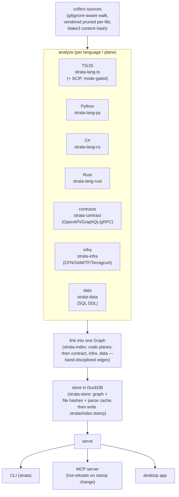

# Architecture

StrataGraph is a Rust workspace of around thirteen crates plus the desktop app (fourteen workspace members in all, including the desktop `src-tauri`). The split is deliberate: a small, pure core that owns correctness; thin language and plane adapters around it; and a heavier desktop shell that depends on the engine but that the engine never depends on. This page maps the crates, walks the indexing pipeline, explains the traits you implement to extend StrataGraph, and describes the gate every change passes.

If you want the full design rationale (the planes, the confidence model, the phased roadmap, the open questions), read [`docs/strata-design.md`](../../strata-design.md). This page is the contributor's orientation to the code.

## The crate map

The workspace is declared in the root `Cargo.toml` as `members = ["crates/*", "apps/strata-desktop/src-tauri"]`. Every crate shares one version and the Apache-2.0 license through `[workspace.package]`, which matches the project license (see [the license statement](../README.md#license)).

| Crate | Owns | Depends on |
|---|---|---|
| `strata-core` | The domain model (`Node`, `Edge`, `NodeKind`, `EdgeKind`, `Confidence`, `Provenance`, `Span`, `Uid`), the in-memory `Graph`, and the traversal engine (`impact`, `context`, `explain`, `query`). Pure Rust, no parsing, no IO. **Correctness lives here.** Also defines the `LanguageAnalyzer` trait and the `AnalyzedFile` shape every analyzer fills. | nothing in the workspace |
| `strata-store` | Persistence behind the `GraphStore` trait, and the `DuckGraphStore` that implements it on DuckDB. Holds the graph, the file-hash map, and the parse cache (keyed by `ANALYZER_SCHEMA_VERSION`, so a schema bump invalidates stale caches). | `strata-core` |
| `strata-scip` | A self-contained SCIP adapter for TypeScript/JavaScript precise resolution: a runner that invokes a pinned `scip-typescript` out-of-process, and a parser/resolver that maps a source position to the symbol it references. Pure and hermetic, tested against checked-in `index.scip` fixtures with no Node at test time. | `strata-core` |
| `strata-lang-ts` | The TS/JS analyzer: Tree-sitter extraction (`analyze`) plus the Node module-resolution algorithm over a `ModuleFs` trait. | `strata-core` |
| `strata-lang-py` | The Python analyzer: Tree-sitter extraction plus `assemble_python`, which links a Python file set within Python's own resolution world. | `strata-core` |
| `strata-lang-cs` | The C# analyzer: Tree-sitter extraction plus `assemble_csharp`. Tree-sitter, **not Roslyn**: every link is a banded heuristic. | `strata-core` |
| `strata-lang-rust` | The Rust analyzer: Tree-sitter extraction plus `assemble_rust`. Tree-sitter, **not rust-analyzer**: same banded-heuristic discipline. | `strata-core` |
| `strata-contract` | The format-agnostic contract plane. A `ContractAdapter` turns a spec file's text into canonical `OperationDef`s. Adapters: OpenAPI/Swagger, GraphQL SDL, protobuf/gRPC. Plus the consumer-matching logic. Pure, no IO. | `strata-core` |
| `strata-infra` | The format-agnostic infrastructure plane. An `IacAdapter` turns an IaC template's text into typed `InfraResource`s and the references between them. Adapters: CloudFormation/SAM, Terraform/OpenTofu HCL, Terraform plan JSON, Terragrunt. Every reference is graded with explicit provenance. Pure, no IO. | `strata-core` |
| `strata-data` | The database (data) plane. A `SchemaAdapter` turns a `.sql` file's DDL into a `SchemaModel`: tables, columns, and the foreign keys between them. Models the declared end-state, never inventing a table or column. Pure, no IO. | `strata-core` |
| `strata-index` | The orchestrator. Walks a repository, content-hashes and caches per file, drives every analyzer and adapter, links the results into one graph, and persists through `strata-store`. Also owns the cross-cutting tools: `detect_changes`, `blast_for_file`, `rename`, the differential accuracy harness, and the estate (multi-repo) machinery. | every crate above |
| `strata-mcp` | The MCP tool surface: the transport-independent dispatch (`call_tool` / `call_tool_ctx`) for `context`, `impact`, `explain`, `query`, `blast`, `detect_changes`, `rename`, plus a hand-rolled JSON-RPC 2.0 server over stdio with hot-reload (`serve_stdio_reloadable`). Symbol resolution (`resolve_symbol`) lives here and is reused by the CLI. | `strata-core`, `strata-store`, `strata-index` |
| `strata-cli` | The `strata` binary: a thin clap front-end over testable handler functions, each returning `Result<String, CliError>`. Owns the `init` agent-kit installer and the concrete `GraphReloader` implementations for single-db and estate serving. | `strata-core`, `strata-store`, `strata-index`, `strata-mcp` |
| `apps/strata-desktop` | The Tauri desktop app: the Rust engine in-process (`src-tauri/`) behind a Vite + TypeScript UI with a WebGL graph view (`ui/`). | `strata-core`, `strata-store`, `strata-index`, `strata-mcp` |

The dependency direction is strict and never reversed: `strata-core` depends on nothing in the workspace; analyzers and plane crates depend only on core; `strata-index` depends on all of them; the MCP, CLI, and desktop surfaces depend on the engine. This is what keeps the core pure and unit-testable without IO.

## The lean-engine / heavy-desktop split

The deterministic engine (everything from `strata-core` through `strata-cli`) ships as one small binary with no language-model dependency and no network requirement. The desktop app is a separate, heavier artifact (Tauri, a WebGL renderer, a Node-built UI) that embeds the same engine crates in-process. The engine never depends on the desktop, so:

- The CLI and MCP server build and run without any of the desktop's UI toolchain.
- The desktop app is always a strict consumer of the engine's public API; it cannot smuggle logic into the core.
- The same UI shell is intended to back a future hosted front end without changing the engine.

This mirrors the design's packaging stance: the deterministic planes are in the core binary; heavier or specialised additions (more cloud providers, language servers, the future knowledge-plane model pass) are designed to ship as optional extensions so the base install stays small.

## The pipeline

Indexing is one pass: **collect sources → analyze per language and plane → link into the graph → store in DuckDB → serve via CLI / MCP / desktop.** The whole graph-building step is a pure, deterministic function of the analyzed-file set, so an incremental index produces the byte-identical graph a full rebuild would (`incremental == full`).



### Collect

`strata-index` walks the repository honouring `.gitignore` (and a `.strataignore` of the same syntax), computing a blake3 content hash per file. Each language is collected separately with its own extension set and its own belt-and-suspenders skip directories: `node_modules` for TS, `__pycache__`/`venv`/`site-packages` for Python, `bin`/`obj`/`packages`/`.vs` for C#, and critically `target/` for Rust (Cargo's build-output tree, which would otherwise balloon a self-index). Committed third-party dependency *bundles* are pruned **per file** by reading a wheel install's `*.dist-info/RECORD`, so a vendored file is dropped while a name-colliding first-party file the RECORD does not list always survives. `--include-vendored` disables that detection.

### Analyze

Each collected file becomes a `strata_core::AnalyzedFile`. A file whose content hash matches the persisted parse cache is **reused** without re-parsing; only new or changed files are re-parsed with Tree-sitter. TS/JS additionally flows through SCIP when precise resolution is requested and available (`Auto` degrades cleanly to the heuristic; `On` fails loudly; `Off` never runs it). The contract, infra, and data adapters detect and parse their own spec/template/schema files; a malformed input is **skipped with a visible diagnostic**, never a silent drop and never a crash.

### Link

`strata-index` assembles one `Graph` in a fixed order: the code planes first (TS/JS, then Python, C#, Rust, each tagged with its language so a mixed repo stays disjoint), then the contract plane, then infra (after contracts, so the `GraphqlField` nodes the AppSync money link points at already exist), then data (last, so the code nodes a `Reads`/`Writes` edge targets already exist). Every cross-file and cross-plane edge carries a `Provenance` and a `Confidence` capped to its band: the linkers never emit a confidence above what their evidence earns.

### Store

`strata-store` persists three things through `GraphStore`: the graph, the current file-hash map, and the current parse cache. The hot-reload stamp (`.strata/index.stamp`) is written **last**, after every persist returns, so a reader keying off the stamp only ever learns of a fully-written graph.

### Serve

The same persisted graph is served three ways: the `strata` CLI, the MCP server over stdio, and the desktop app. The MCP server hot-reloads: before each request it checks the cheap change signal (the stamp bytes, falling back to the db file's mtime/length) and swaps in the fresh graph if it changed. The reload is degrade-safe: a reindex caught mid-write keeps the previous graph and retries on the next request, so a tool call never blocks or serves a half-loaded graph.

## The extension traits

StrataGraph grows by implementing small, pure traits in core or in a plane crate. None of them touch the filesystem: the caller reads the bytes and hands the adapter text, which is what makes them fixture-testable and deterministic.

### `LanguageAnalyzer` (a new language)

Defined in `strata-core`:

```rust
pub trait LanguageAnalyzer {
    fn extensions(&self) -> &'static [&'static str];
    fn analyze(&self, path: &str, source: &str) -> AnalyzedFile;
}
```

To add a language:

1. Create a `strata-lang-<x>` crate that depends only on `strata-core`, pick a Tree-sitter grammar (exact-pinned in `Cargo.toml`), and implement `analyze` to fill the code-plane vecs of `AnalyzedFile` (`symbols`, `imports`, `calls`).
2. Add an `assemble_<x>` linker that adds the language's nodes and **band-disciplined** edges to a `Graph`, resolving within its own world. Every heuristic confidence is a doc-commented constant capped to its provenance band, and a link you cannot make is counted, never invented.
3. Wire it into `strata-index`: add a collector with the language's extension set and skip directories, run the analyzer in the cache loop, and call `assemble_<x>` during linking.
4. Write the extraction fixtures and an accuracy report under `docs/accuracy/`. Compiler-grade precision (a SCIP/LSP backend) comes later as its own slice, exactly as TS already has via `strata-scip`.

Python, C#, and Rust were all added this way, each as a pair of milestones (extraction, then indexer wiring).

### `ContractAdapter`, `IacAdapter`, `SchemaAdapter` (a new plane format)

Each plane crate exposes a `detects` + `extract` pair, pure and no-IO:

- `strata-contract::ContractAdapter` → `OperationDef`s (OpenAPI, GraphQL, gRPC implement it).
- `strata-infra::IacAdapter` → `InfraResource`s plus their references, each graded by `RefValue` (`Resource` for a same-template ref, `Inferred` for a recovered interpolation, `Unresolved` surfaced honestly).
- `strata-data::SchemaAdapter` → a `SchemaModel` of tables, columns, and foreign keys.

To add a format (say AsyncAPI to the contract plane, or a Kubernetes adapter to infra): implement the trait in the plane crate, then add it to the relevant `extract_repo_*` call in `strata-index` so it is detected and extracted alongside the existing formats. A new plane entirely follows the same shape: a new crate with an adapter trait, a `build_<plane>_plane` in `strata-index`, and additive `NodeKind`/`EdgeKind` variants in `strata-core` (with the schema version bumped). The pattern is uniform on purpose: all three planes flow through one `build_*_plane` path each.

## The gate

Every change passes the same mechanical gate before it merges. These are the exact commands; run them unpiped so the exit codes are real:

```bash
cargo test --workspace
cargo clippy --workspace --all-targets -- -D warnings
cargo fmt --check
```

When a change touches the desktop UI, add its build and unit tests:

```bash
# from apps/strata-desktop/ui
npm run build      # tsc && vite build
npm run test       # vitest run
```

Clippy runs with `-D warnings`: a warning is a failure. `cargo fmt --check` fails on any unformatted line; run `cargo fmt` to fix. See [Contributing](contributing.md) for the full workflow, the test conventions, and how to regenerate the accuracy corpora.

### The accuracy harness

Beyond correctness tests, StrataGraph measures the precision of its heuristic resolution against compiler ground truth. The differential harness in `strata-index` (`accuracy_report`, the `Band`/`BandMetrics` API) builds the graph the fast way (Tree-sitter heuristics) and compares it to a precise SCIP index treated as truth, reporting per-class and per-band precision and recall. The ground-truth `index.scip` files are committed fixtures; the gate consumes them hermetically with no indexer at test time. They are regenerated only by the `#[ignore]`d generators in `crates/strata-index/tests/gen_scip.rs` (which need Node or rust-analyzer and a network), and the per-language reports live in `docs/accuracy/`. The CI floors in those reports are guardrails: a regression that drops measured precision below a floor fails the suite. See [How accuracy is measured](../accuracy/methodology.md).
